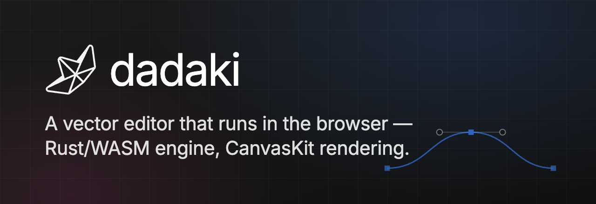
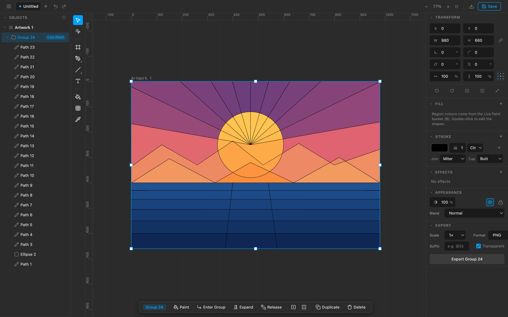

# Dadaki Vector Editor

**[dadaki.com](https://dadaki.com)** — a high-performance, in-browser **vector
graphics editor**: Rust/WASM + CanvasKit core, TypeScript UI. This repository is
the **open-source** editor.



It is a pnpm workspace with two packages:

| Package                          | What it is                                                            |
| -------------------------------- | -------------------------------------------------------------------- |
| [`@dadaki/editor`](packages/editor) | The reusable, embeddable editor **library** (`createEditor`).      |
| [`@dadaki/app`](packages/app)       | A deployable **demo shell** — local-only, no backend required.     |

The hosted product (accounts, teams, cloud sync) lives in a **separate** repo
(`dadaki-cloud`) and consumes `@dadaki/editor` as a dependency. This repo has no
dependency on it, and no dependency on any specific backend.

## Quick start

```bash
corepack pnpm@11.9.0 install

# Run the editor standalone — local-only, NO backend or cloud
pnpm dev
# → http://localhost:5199
```

That's the whole open-source editor: no account, no server, files stay in your
browser. `pnpm build` produces a static bundle; `pnpm preview` serves it.

### Scripts

| Command          | What it runs                                                        |
| ---------------- | ------------------------------------------------------------------- |
| `pnpm dev`       | Standalone editor (no cloud) — http://localhost:5199                |
| `pnpm build`     | Production build of the standalone editor                           |
| `pnpm preview`   | Serve the production build locally                                  |
| `pnpm test`      | Unit tests (vitest)                                                 |
| `pnpm check`     | Typecheck                                                           |
| `pnpm lint` / `pnpm format` | Biome lint / format                                      |
| `pnpm dev:cloud` | The hosted app **if** you have the separate `cloud/` repo checked out locally (backend + frontend via Rebase). Not part of this repo. |

> **pnpm version:** this repo pins pnpm `^11` via `devEngines`. Use pnpm **11.9.0**
> (`corepack pnpm@11.9.0`). Homebrew's pnpm 11.1.0 hits a bug on the `devEngines`
> field here (`Cannot use 'in' operator to search for 'integrity'`).

## Develop

```bash
./node_modules/.bin/tsc --noEmit -p packages/editor/tsconfig.json   # typecheck lib
./node_modules/.bin/tsc --noEmit -p packages/app/tsconfig.json      # typecheck app
./node_modules/.bin/vitest run                                      # unit tests
./node_modules/.bin/biome check --write                             # lint + format
./node_modules/.bin/vite build packages/app                         # production build
```

### SVG conformance suite

`tests/svg-suite/harness.mjs` renders ~1679 SVG fixtures through the app and
pixel-diffs against `tests/svg-suite/baseline.json` (a resvg reference).

It drives the editor in headless Chrome, which Puppeteer downloads separately —
`pnpm install` does **not** fetch it. Once per machine:

```bash
./node_modules/.bin/puppeteer browsers install chrome
```

Then run the suite:

```bash
node tests/svg-suite/harness.mjs
```

## The engine (Rust/WASM)

`packages/editor/engine/` is the Rust crate; `packages/editor/engine/pkg/` is the
wasm-bindgen output, imported by the editor via a relative path
(`../engine/pkg/engine`). That output is **committed**, so a fresh clone runs,
typechecks and tests without the Rust toolchain — day-to-day editor work does
**not** need a rebuild.

If you change the Rust, rebuild it:

```bash
cd packages/editor/engine && wasm-pack build --target web --release
```

Then **commit the regenerated `pkg/`** along with your `src/lib.rs` change, and
re-run the JS tests — they import the built wasm, so without a rebuild they test
the old engine. The browser caches it too; hard-reload after rebuilding.

> `wasm-pack` writes a `.gitignore` containing `*` into `pkg/` on every build.
> That file is itself ignored (see the root `.gitignore`) so it cannot re-hide
> the committed output.

## Embedding

See [`packages/editor/README.md`](packages/editor/README.md) for the
`createEditor(container, options)` API and the host contract.

## License

MIT © Dadaki — see [LICENSE](LICENSE).
